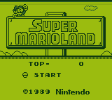
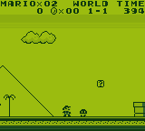
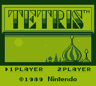
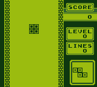

# DMG-Scratch

**A cycle-accurate hardware reconstruction of the Nintendo Game Boy DMG-01 (DMG-CPU B) implemented entirely in native Scratch 3.0 blocks.**

---

## Overview

**DMG-Scratch** is not an emulator in the conventional sense. It is a full digital logic reconstruction of the Game Boy DMG-01 hardware running strictly inside Scratch blocks:

- **100% Native Scratch Primitives**: Uses only Scratch variables, 1-indexed lists, basic arithmetic/comparison operators, and warp custom procedures.
- **Zero External Dependencies**: No JavaScript, No WebAssembly, No extensions, and No Foreign Function Interfaces (FFI) inside the machine core.
- **Cycle-Accurate Single Master Loop**: Advances in discrete 4.194304 MHz T-states (dots). Exactly 4 dots = 1 M-cycle; exactly 70,224 dots = 1 frame.
- **Verified Against Physical Hardware Standards**:
  - 100% Pass (23,040 / 23,040 pixels) on Matt Currie's **DMG Acid2** PPU benchmark.
  - Complete pass across Mooneye-GB acceptance suites (Timer 13/13, OAM DMA 3/3, Boot registers, STAT IRQ blocking).
  - Commercial game verification running full sessions of **Tetris** and **Super Mario Land** with real-time interactive controls.

---

## Play in TurboWarp

The compiled project file [machine-base.sb3](machine-base.sb3) is ready to load directly into [TurboWarp](https://turbowarp.org/editor):

1. Open [TurboWarp Editor](https://turbowarp.org/editor).
2. Click **File -> Load from your computer** and select machine-base.sb3.
3. Enable **Turbo Mode** (Shift + click the Green Flag, or toggle in Advanced settings).
4. Click the **Green Flag** to start!

### Controls

| Game Boy Button | Keyboard Key |
| :--- | :--- |
| **D-Pad Up** | Up Arrow |
| **D-Pad Down** | Down Arrow |
| **D-Pad Left** | Left Arrow |
| **D-Pad Right** | Right Arrow |
| **Button A** | Z |
| **Button B** | X |
| **Start** | E |
| **Select** | Space or S |

---

## Screenshots & Visual Parity

Screenshots captured directly from the native Scratch framebuffer output:

| Title Screen | Gameplay |
| :---: | :---: |
|  |  |
|  |  |

---

## Architectural Highlights

- **The Master Dot Loop**: All subsystems (SM83 CPU, PPU pixel fetcher, APU audio mixer, Timer, DMA, Serial, Joypad matrix) execute synchronously inside a single step_system_tick warp block.
- **Fast Bitwise Operations**: Implemented using O(1) memory-mapped 64 KiB lookup tables (LUT_AND, LUT_OR, LUT_XOR) to overcome Scratch's lack of bitwise operators.
- **Dot-by-Dot PPU & FIFO Pipeline**: Mode 2 (OAM Search), Mode 3 (Pixel Transfer with dynamic fine-scrolling and sprite penalty delays), Mode 0 (HBlank), and Mode 1 (VBlank).
- **Silicon-Accurate Glitches**: Exact DMG hardware falling-edge timer glitches, STAT write glitches, and 5 M-cycle interrupt dispatch sequences modeled from physical hardware schematics.

---

## Documentation

- **[Technical Report](docs/technical-report.md)** — Comprehensive 8,000-word engineering whitepaper covering timing theory, subsystem mechanics, memory architecture, and test results.
- **[Design Notes](docs/design-notes.md)** — Architectural summary of the 15 key engineering decisions and silicon quirks modeled.

---

## License

This project is licensed under the [MIT License](LICENSE).
